# Cat And Dog Image Classifier
This repository uses Python and the TensorFlow framework to create a convolutional neural network model that can classify images of dogs and cats. The project was completed as part of the [freeCodeCamp](https://www.freecodecamp.org/) [Machine Learning with Python Certification](https://www.freecodecamp.org/learn/machine-learning-with-python/). 

## **Getting Started**
#
**These instructions will get you a copy of the project up and running on your local machine for developement and testing purposes. See [Deployment](#Deployment "Goto **Deployment**") for notes on how to deploy the project on a live system.**


## **Prerequisites**
#
**What things you need to install the software and how to install them.**

* Google Account

## **Installing**
#
**A step by step series of examples that tell you how to get a development environment running.**

*Setting up a Google account is very easy. You can follow the steps below or click the link to Google Account Help below to get started.*

[Google Account Help](https://support.google.com/accounts/answer/27441?hl=en)

1. Go to the [Google account Sign In page](https://myaccount.google.com/?utm_source=sign_in_no_continue&pli=1).
2. Click ```Create account```.
3. Enter your name.
4. In the "Username" field, enter a username.
5. ```Enter``` and confirm your password.
6. Click ```Next```.

    *Optional: Add and verify a phone number for your account.*

7. Click ```Next```.

## **Deployment**
#

**Open Google Colab**

1. Click on the [Copy_of_fcc_cat_dog.ipynb](https://github.com/JonWeber0328/Cat_And_Dog_Image_Classifier/blob/main/Copy_of_fcc_cat_dog.ipynb) 
file in this repository.

2. Click on "Open in Colab" as shown in the following image.
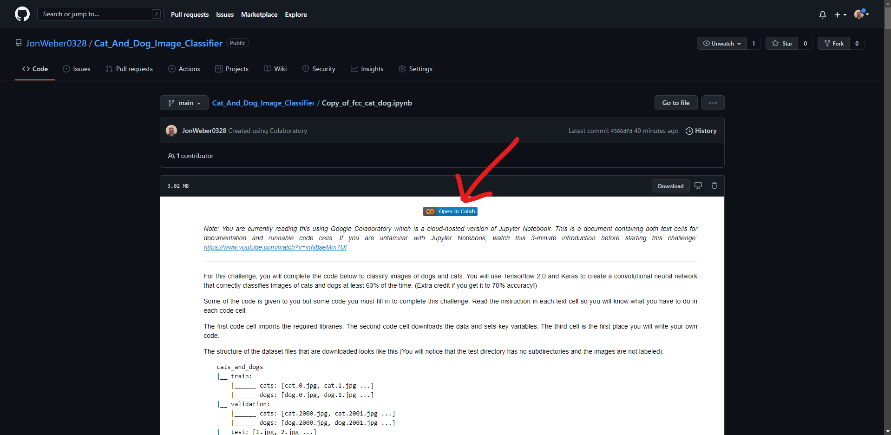

3. Click on "Save a copy in Drive" under the File dropdown.
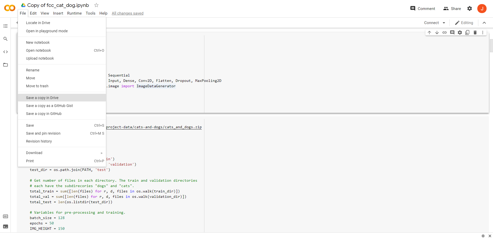

    *You should now have your own copy on your Google My Drive.*

# **Acknowledgments**
#
* I'd like to thank [Dominic LaBella](https://www.linkedin.com/in/dominiclabella/), my instructor at the Data Visualization and Analytics Boot Camp I attended, for planting a seed in my brain that was the start of my computer programming knowledge and understanding. I work hard every day to grow that seed. None of this would be possible for me if not for his passion for teaching and deep understanding of these subjects.

## **Project Visuals**
#
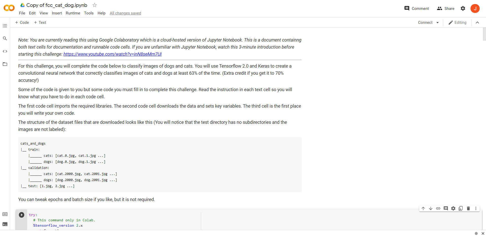

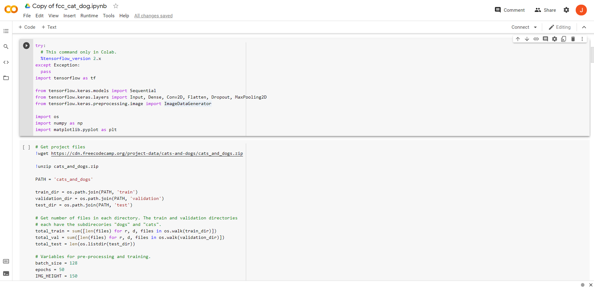

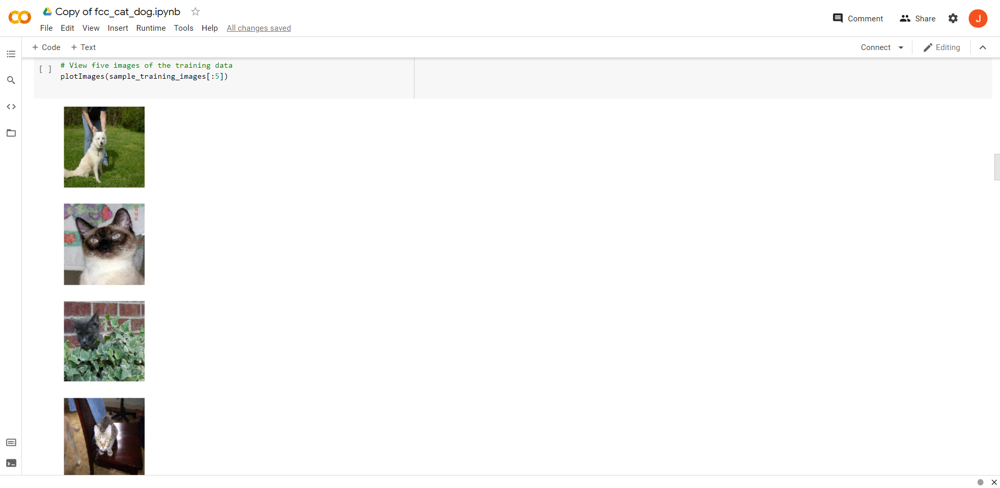

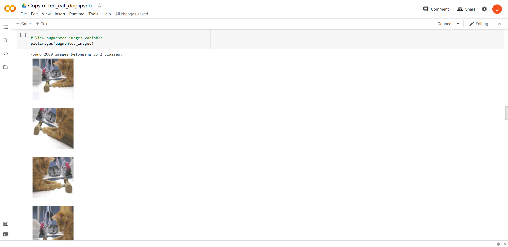

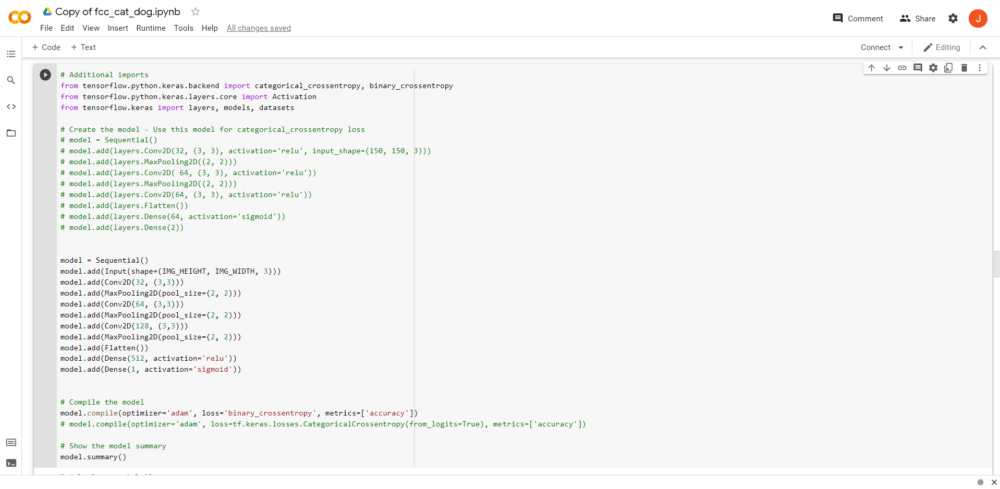

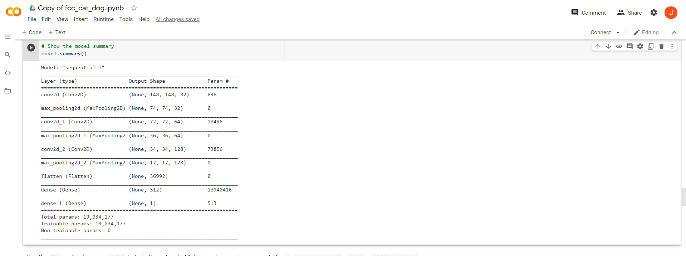

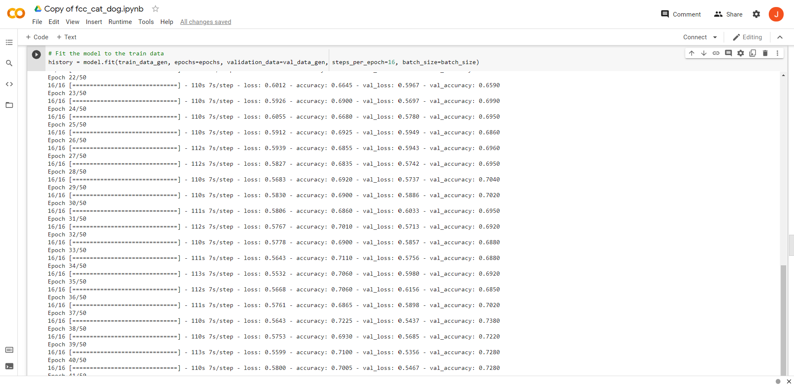

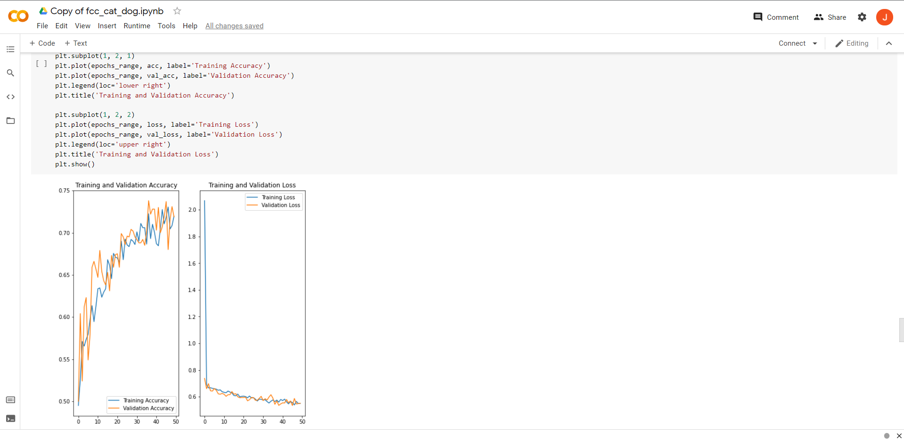

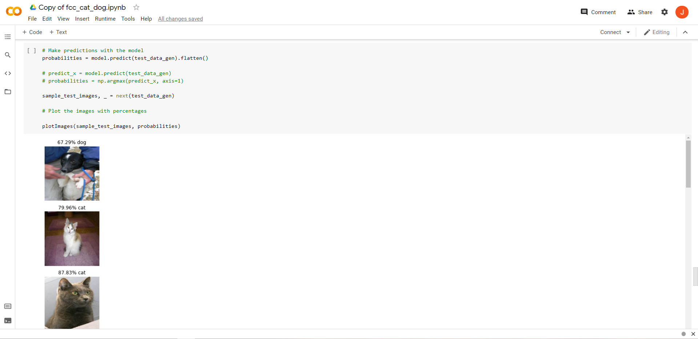

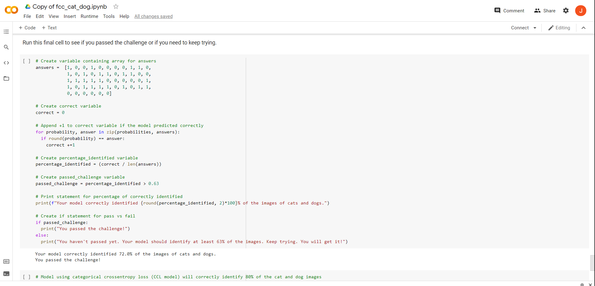

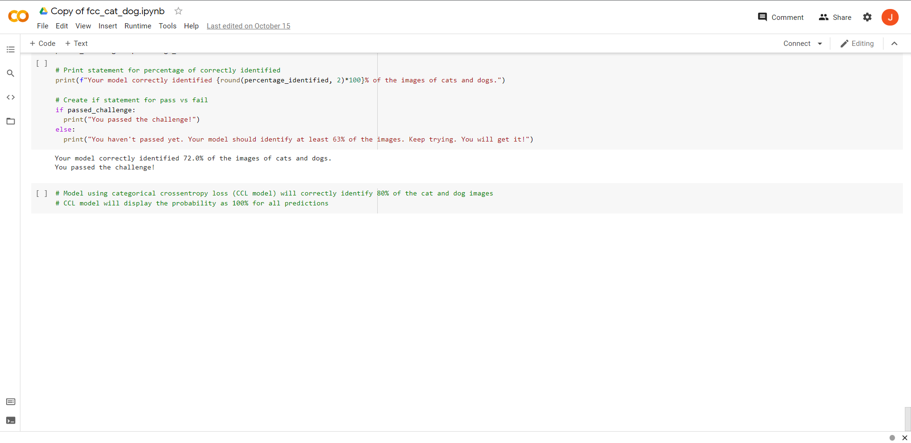
